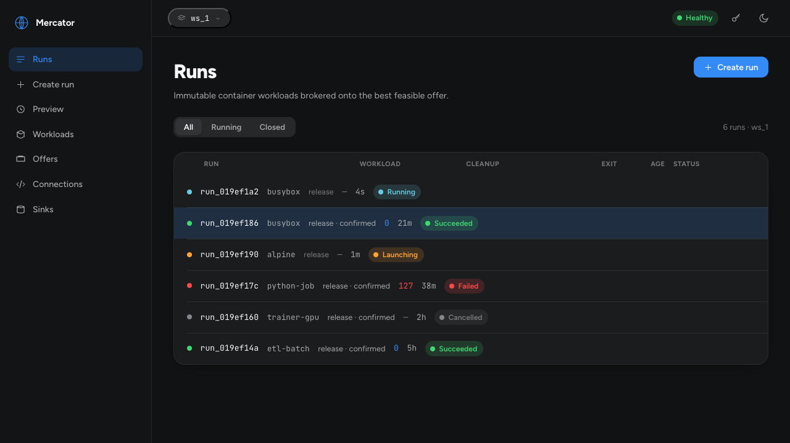
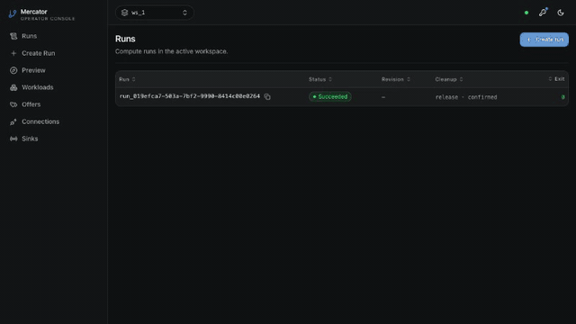
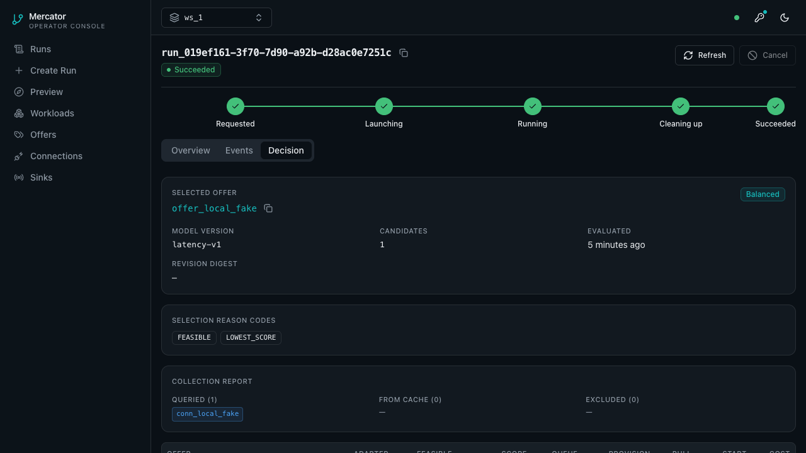

# Mercator

Mercator is an **event-sourced OCI run broker** for teams that need to run
immutable container workloads on the best feasible compute offer without
adopting a cluster control plane.

> "Run this container image now, on the cheapest/fastest feasible place, and
> tell me exactly what happened."



Watch the short fake-adapter console demo:
[WebM](docs/assets/mercator-demo.webm) or
[GIF fallback](docs/assets/mercator-demo.gif). A text transcript is in
[docs/assets/README.md](docs/assets/README.md#demo-transcript).



## Why It Exists

Small teams often outgrow "ssh into a box and start Docker" before they are
ready to operate Kubernetes, Slurm, or a custom GPU scheduler. The hard parts
show up quickly:

- placement decisions need to explain why one machine or provider won;
- retries need idempotency, not duplicate launches;
- operators need a run history, exit codes, cleanup status, and event audit;
- workloads should not leak secrets into public events;
- local Docker, standing pools, and cloud GPU providers need one run contract.

Mercator keeps that surface small. It runs as one Go process with SQLite as the
event log, exposes a JSON HTTP API and CLI, embeds an operator console, and
drives provider adapters through an auditable run lifecycle.

## What It Does

- Accepts a minimal image shorthand or a full OCI workload revision.
- Resolves and records immutable workload/run state in an event log.
- Filters offers by platform, resources, accelerator needs, capability facts,
  price constraints, and policy.
- Records placement decisions and rejected candidates for audit.
- Launches through fake, Docker, and RunPod-oriented adapter paths.
- Surfaces run status, exit codes, cleanup disposition, public events, sink
  cursors/replay, and workspace-scoped reads.
- Provides hand-written TypeScript, Python, and Ruby SDKs for the V1 API.

Mercator is **V1 evaluation-ready, not GA infrastructure yet**. See
[Known Limitations](docs/production/known-limitations.md) and
[Roadmap](ROADMAP.md) before relying on it for production workloads.

## Try It In 5 Minutes

The fake adapter exercises the full broker path without Docker, RunPod, or a
registry. You need Go 1.25+, `jq`, and a shell.

For the fastest local confidence check, run the smoke test:

```sh
scripts/smoke-test-fake.sh
```

It builds a temporary `mercator` binary, starts a local fake-adapter server,
creates a `busybox` run through the CLI, and verifies the run closes with
`outcome=succeeded`, `exit_code=0`, `cleanup=confirmed`, and `closed=true`.

Terminal 1:

```sh
rm -f /tmp/mercator-demo.db /tmp/mercator-demo.db-wal /tmp/mercator-demo.db-shm

export MERCATOR_ADDR=127.0.0.1:8080
export MERCATOR_SQLITE_DSN='file:/tmp/mercator-demo.db'
export MERCATOR_API_TOKEN='dev-token'
export MERCATOR_AUTH_WORKSPACES='ws_1'
export MERCATOR_FAKE_OFFER=1

go run ./cmd/mercator serve
```

Terminal 2:

```sh
export MERCATOR_API_URL=http://127.0.0.1:8080
export MERCATOR_API_TOKEN='dev-token'
export MERCATOR_WORKSPACE_ID=ws_1

RUN_ID="$(go run ./cmd/mercator run create busybox -- echo hi | jq -r '.run.id')"

go run ./cmd/mercator run get --run-id "$RUN_ID" \
  | jq '{id: .run.id, outcome: .run.outcome, exit_code: .run.exit_code, cleanup: .run.cleanup, closed: .run.closed}'
```

Expected shape:

```json
{
  "id": "run_...",
  "outcome": "succeeded",
  "exit_code": 0,
  "cleanup": "confirmed",
  "closed": true
}
```

Open the console at
[`http://127.0.0.1:8080/?workspace_id=ws_1`](http://127.0.0.1:8080/?workspace_id=ws_1)
and paste `dev-token` when prompted.

For a fuller local evaluation, use
[docs/production/fake-eval-path.md](docs/production/fake-eval-path.md). For a
real Docker host, use
[docs/production/docker-adapter-operation.md](docs/production/docker-adapter-operation.md).

## SDK Happy Path

The SDKs hide the low-level idempotency mechanics for the common case. A caller
can ask Mercator to run an image, wait for closure, and read the exit code from
the run object.

```python
from mercator import MercatorClient

client = MercatorClient("http://127.0.0.1:8080", token="dev-token", workspace_id="ws_1")

created = client.run_image("busybox", args=["echo", "hi"])
result = client.wait_run_until_terminal(created["run_id"])

print(result["run"]["outcome"], result["run"]["exit_code"])
```

- TypeScript: [sdk/typescript](sdk/typescript/README.md)
- Python: [sdk/python](sdk/python/README.md)
- Ruby: [sdk/ruby](sdk/ruby/README.md)

## Console

The embedded React console is built into `web/static` and served by the Go
binary. It is meant for operators to scan runs, inspect placement decisions,
manage connections, and replay sink delivery.



Frontend source lives in [web/app](web/app/README.md). To rebuild the embedded
assets:

```sh
mise run ui
go build ./cmd/mercator
```

## Documentation Map

| Need | Start Here |
| --- | --- |
| Install, start, health checks | [docs/production/install-configuration.md](docs/production/install-configuration.md) |
| First deterministic evaluation | [docs/production/fake-eval-path.md](docs/production/fake-eval-path.md) |
| CLI commands and environment | [docs/reference/cli.md](docs/reference/cli.md) |
| Docker adapter operation | [docs/production/docker-adapter-operation.md](docs/production/docker-adapter-operation.md) |
| Workload and run lifecycle | [docs/production/workload-run-lifecycle.md](docs/production/workload-run-lifecycle.md) |
| Authentication and workspaces | [docs/production/authentication-workspaces.md](docs/production/authentication-workspaces.md) |
| Security boundaries | [docs/production/security-model.md](docs/production/security-model.md) |
| Backup and restore | [docs/production/backup-recovery.md](docs/production/backup-recovery.md) |
| Human evaluation checklist | [docs/production/human-eval-checklist.md](docs/production/human-eval-checklist.md) |
| Compatibility policy | [docs/project/compatibility.md](docs/project/compatibility.md) |
| Threat model | [docs/project/threat-model.md](docs/project/threat-model.md) |
| Package and distribution plan | [docs/project/package-distribution.md](docs/project/package-distribution.md) |
| Starter contributor queue | [docs/project/contributor-starter-queue.md](docs/project/contributor-starter-queue.md) |
| External reviewer packet | [docs/launch/reviewer-packet.md](docs/launch/reviewer-packet.md) |
| Public launch runbook | [docs/launch/public-launch-runbook.md](docs/launch/public-launch-runbook.md) |
| Public proof point template | [docs/launch/proof-point-template.md](docs/launch/proof-point-template.md) |
| Release process | [docs/project/release-process.md](docs/project/release-process.md) |
| Open source launch readiness | [docs/launch/open-source-readiness.md](docs/launch/open-source-readiness.md) |

## Build And Test

```sh
go test ./...
go build ./...
go run ./cmd/mercator --help

cd sdk/typescript && npm ci && npm test
cd ../python && python3 -m unittest discover -s tests
cd ../ruby && bundle install && bundle exec ruby -Ilib:test test/test_client.rb
```

The Go binary uses the pure-Go SQLite driver `modernc.org/sqlite`, so normal
builds do not require cgo.

## Project Status

Current branch status:

- M13-verified V1 broker slice with fake, Docker, and RunPod-oriented paths.
- Embedded operator console and JSON-first CLI.
- Hand-written SDKs for TypeScript, Python, and Ruby.
- Production evaluation docs and known limitations are checked in.
- Open source launch prep is underway; screenshots and a short demo video are
  tracked, and the remaining launch scorecard is in
  [docs/launch/open-source-readiness.md](docs/launch/open-source-readiness.md).

Important pre-GA gaps include package publishing, release tags, public CI run
history, stronger external sink wiring, registry credential flows, social proof,
and external threat-model review.

## Contributing

Read [CONTRIBUTING.md](CONTRIBUTING.md) before opening a pull request. The
short version: keep changes narrow, include tests or docs evidence, run the
relevant local checks, and update production docs when behavior changes.

Security issues should be reported privately. See [SECURITY.md](SECURITY.md).

## License

Mercator is licensed under the Apache License, Version 2.0. See
[LICENSE](LICENSE) and [NOTICE](NOTICE).
